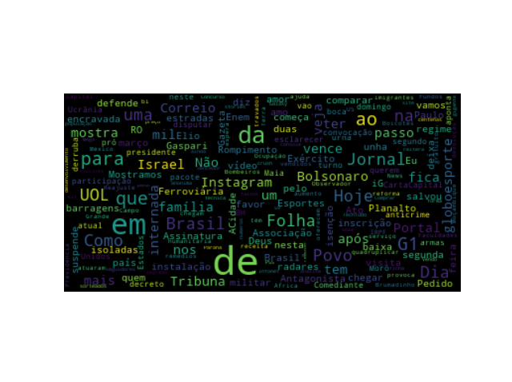

# google-news-world-cloud 

Generate a world cloud with the headlines of google news.

# pre requisites

```
pip install feedparser
pip install word-cloud
pip install matplotlib
```

# screenshot


