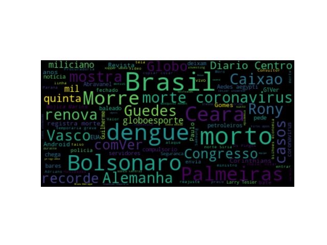

# google-news-world-cloud 

Generate a world cloud with the headlines of google news.

# pre requisites

```
pip install feedparser
pip install wordcloud
pip install matplotlib
```
# stop words

[Stop Words](https://en.wikipedia.org/wiki/Stop_words) list retrieved from [Google stop-words](https://code.google.com/archive/p/stop-words/)

# screenshot


